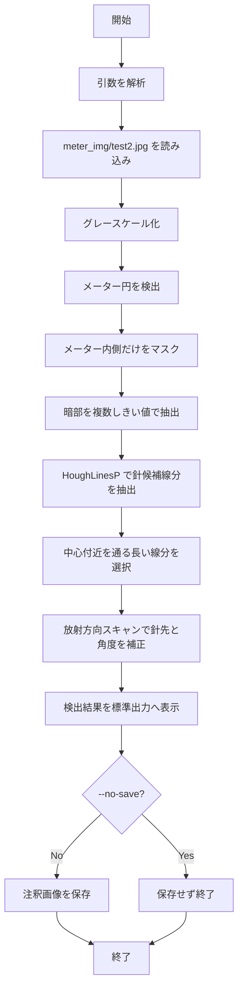

# メーター針検出 処理フロー

## 対象

- 入力画像: `meter_img/test2.jpg`
- 実行スクリプト: `detect_meter_needle.py`
- 出力画像: `output/test2_needle_detected.jpg`

このプログラムは `meter_img/test2.jpg` のみを入力として扱う。ほかの画像は読み込まない。

## 全体フロー



## 詳細フロー

### 1. 引数解析

`parse_args()` で以下を受け取る。

| 引数 | 内容 |
| --- | --- |
| `--output` | 注釈画像の保存先。省略時は `output/test2_needle_detected.jpg` |
| `--no-save` | 指定時は画像保存を行わず、検出結果の表示だけを行う |

入力画像パスは固定で、`IMAGE_PATH = meter_img/test2.jpg` を使用する。

### 2. 画像読み込み

`cv2.imread()` で `meter_img/test2.jpg` を読み込む。読み込みに失敗した場合は `FileNotFoundError` を送出する。

### 3. メーター円検出

`find_meter_circle()` でメーター外周円を検出する。

処理手順:

1. グレースケール画像に `cv2.medianBlur(gray, 5)` を適用する。
2. `cv2.HoughCircles()` で円候補を抽出する。
3. `param2` を `70` から `20` まで段階的に下げ、複数の円候補を集める。
4. 近い中心座標と半径を持つ重複候補を除外する。
5. 各円候補を `score_circle()` で評価する。
6. スコア最大の円をメーター円として採用する。

円候補の評価では、メーターの特徴である「明るい文字盤」と「暗い外周ベゼル」を利用する。

```text
score = inner_mean - ring_mean + inner_mean * 0.05
```

### 4. 針候補線分の抽出

`choose_needle_line()` で針の大まかな線分を選ぶ。

処理手順:

1. メーター円の内側 `radius * 0.82` を対象領域にする。
2. 中心のハブ付近 `radius * 0.06` はマスクから除外する。
3. しきい値 `50` から `125` まで、5刻みで暗部を抽出する。
4. 抽出した暗部にモルフォロジーの close 処理を行い、針の細かい途切れを補う。
5. `cv2.Canny()` でエッジ化する。
6. `cv2.HoughLinesP()` で線分候補を抽出する。
7. 次の条件で候補を絞る。

| 条件 | 目的 |
| --- | --- |
| 線分長が十分長い | 目盛りや文字の短い線分を除外する |
| 線分がメーター中心付近を通る | 数字や外周目盛りを除外する |
| 中心から遠い端点が適切な距離にある | 針として短すぎる、または外周に寄りすぎる候補を除外する |
| 線分上の暗画素率が十分高い | ノイズ由来の線分を除外する |

最終スコアは、線分長、中心から遠い端点までの距離、中心との近さ、暗画素率を組み合わせて計算する。

### 5. 針先と角度の補正

HoughLinesP は針の中心線ではなく、針のエッジを拾う場合がある。そのため `refine_needle_tip()` で放射方向スキャンを行い、針方向を補正する。

処理手順:

1. 選ばれた線分のうち、メーター中心から遠い端点を仮の針先とする。
2. 仮の針先から大まかな角度を計算する。
3. その角度の前後 `18` 度を探索範囲にする。
4. 各角度について、中心から外側へ放射状に暗画素をスキャンする。
5. 暗画素の連続性、中心付近からの接続、外側まで伸びているかをスコア化する。
6. スコア最大の角度を針方向として採用する。
7. 最後に暗画素が見つかった半径位置を針先座標として採用する。

### 6. 角度の扱い

出力する角度は 2 種類ある。

| 値 | 内容 |
| --- | --- |
| `image_angle_deg` | 画像座標系の角度。右方向が 0 度、下方向が 90 度 |
| `cartesian_angle_deg` | 数学座標系の角度。右方向が 0 度、上方向が 90 度 |

`test2.jpg` での検出例:

```text
meter_circle: center=(770, 469), radius=154
needle: center=(770, 469), tip=(658, 404), image_angle=210.18 deg, cartesian_angle=149.82 deg
```

### 7. 注釈画像の保存

`draw_detection()` で検出結果を画像上に描画する。

描画内容:

| 色 | 内容 |
| --- | --- |
| 緑 | 検出したメーター円 |
| 青 | メーター中心 |
| 赤 | 検出した針方向と針先 |

`--no-save` が指定されていない場合、注釈画像を `output/test2_needle_detected.jpg` に保存する。

## 実行方法

仮想環境を有効化して実行する。

```bat
cmd /c "..\..\scripts\activate.bat && python .\detect_meter_needle.py"
```

画像保存を行わない場合:

```bat
cmd /c "..\..\scripts\activate.bat && python .\detect_meter_needle.py --no-save"
```
