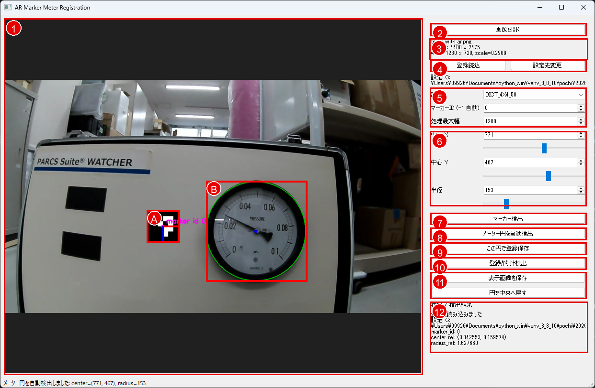

# ARマーカー式メーター針検出 GUI 説明書

対象アプリ: `ar_marker_meter_gui.py`

起動コマンド:

```bat
cmd /c "..\..\scripts\activate.bat && python .\ar_marker_meter_gui.py"
```

## 画面構成

スクリーンショット `docs/image.png` の画面は、左側が画像プレビュー、右側が操作パネルです。

以下の赤枠付き画像では、操作箇所を番号で示しています。



| 番号 | 操作箇所 | 主な挙動 |
| --- | --- | --- |
| 1 | 画像プレビュー | 読み込んだ画像、ARマーカー、メーター円、針検出結果を表示する。画像上をクリックまたはドラッグすると、メーター円の中心をその位置へ移動する。 |
| A | ARマーカー表示 | `マーカー検出` 後に表示される。紫枠が検出マーカー、赤/青の軸がマーカーの向きを示す。 |
| B | メーター円表示 | 現在登録または指定しているメーター円。緑円が半径、青点が中心を示す。 |
| 2 | 画像を開く | 検出または登録に使う画像を選択する。選択後、プレビューと画像情報が更新される。 |
| 3 | 画像情報 | 元画像サイズ、処理用画像サイズ、縮小率を表示する。 |
| 4 | 登録読込 / 設定先変更 | 登録JSONを読み込む、または登録JSONの保存先を変更する。 |
| 5 | ARマーカー設定 | 辞書、マーカーID、処理最大幅を指定する。 |
| 6 | メーター円設定 | 中心X、中心Y、半径を数値入力またはスライダーで調整する。 |
| 7 | マーカー検出 | 現在の画像からARマーカーを検出し、プレビューへ紫枠で表示する。 |
| 8 | メーター円を自動検出 | 画像からメーター円を推定し、中心X/Yと半径を自動更新する。 |
| 9 | この円で登録保存 | 検出済みARマーカーと現在のメーター円の相対位置をJSONに保存する。 |
| 10 | 登録から針検出 | 登録JSONを使ってARマーカーからメーター円を復元し、針検出を実行する。 |
| 11 | 表示画像を保存 / 円を中央へ戻す | 現在のプレビュー画像を保存する、またはメーター円を画像中央へ戻す。 |
| 12 | 状態 / 検出結果 | 登録結果、相対位置、針先、角度、エラー内容などを表示する。 |

左側の画像プレビューには、現在読み込んでいる画像と検出・登録状態が重ねて表示されます。

| 表示 | 意味 |
| --- | --- |
| 緑の円 | 現在指定されているメーター円 |
| 青い点 | メーター円の中心 |
| 紫の四角 | 検出されたARマーカー |
| `marker id 0` の文字 | 検出されたARマーカーID |
| 赤/青の短い軸線 | ARマーカーの向き |
| 赤い線 | 針検出後の針方向 |

画面下部のステータスバーには、直近の操作結果やエラー内容が表示されます。

## 操作パネル

### 画像を開く

画像ファイルを選択します。

対応例:

- `.jpg`
- `.jpeg`
- `.png`
- `.bmp`
- `.tif`
- `.tiff`

画像を開くと、左側のプレビューが切り替わります。右側には以下の情報が表示されます。

```text
source: 元画像サイズ
work: 処理用画像サイズ
scale: 元画像から処理用画像への縮小率
```

このアプリは高解像度画像をそのまま処理せず、`処理最大幅` に合わせて内部的にリサイズします。表示・登録・検出で使う中心座標と半径は、`work` 側の処理用画像座標です。

### 登録読込

保存済みのARマーカー登録JSONを読み込みます。

読み込まれる内容:

- ARマーカー辞書
- マーカーID
- 処理最大幅
- ARマーカーからメーター中心までの相対位置
- ARマーカーサイズに対するメーター半径比

読み込み後、登録値を使って `登録から針検出` ができる状態になります。

### 設定先変更

登録JSONの保存先を変更します。

`この円で登録保存` を押したとき、ここで指定したJSONファイルに登録内容が保存されます。

### 辞書

ARマーカー検出に使う辞書を選びます。

スクリーンショットでは `DICT_4X4_50` が選択されています。`test2_with_ar.png` のマーカーは `DICT_4X4_50`、ID `0` として検出されます。

辞書が合っていない場合、`マーカー検出` を押してもマーカーが見つかりません。

### マーカーID (-1 自動)

検出対象のARマーカーIDを指定します。

| 値 | 挙動 |
| --- | --- |
| `0` 以上 | 指定したIDのマーカーだけを使う |
| `-1` | 検出されたマーカーのうち、最も大きいものを自動選択する |

通常は、登録時と検出時で同じIDを使います。

### 処理最大幅

画像を内部処理するときの最大幅を指定します。

例:

```text
source: 4400 x 2475
work: 1280 x 720
scale=0.2909
```

この場合、元画像は幅 `1280` に縮小されて処理されます。大きい画像を安定して処理するための設定です。

注意点:

- 登録時と検出時で同じ値を使うのが基本です。
- 登録JSONにはこの値も保存されます。
- 値を変えると、中心X/Yと半径の座標系も変わります。

### 中心 X / 中心 Y

メーター円の中心座標を指定します。

操作方法:

- 数値欄で直接入力する
- スライダーで調整する
- 左側の画像プレビューをクリック、またはドラッグする

クリックした位置がメーター円の中心になります。

### 半径

メーター円の半径を指定します。

操作方法:

- 数値欄で直接入力する
- スライダーで調整する

半径を変更すると、左側の緑の円が即時更新されます。

## ボタン操作

### マーカー検出

現在の画像からARマーカーを検出します。

成功すると、左側のプレビューに紫の四角と `marker id ...` が表示されます。

内部処理:

1. 選択中の `辞書` を使う
2. `マーカーID` が `0` 以上なら、そのIDだけを探す
3. `マーカーID` が `-1` なら、最も大きいマーカーを選ぶ
4. マーカー中心、向き、辺の長さを取得する

### メーター円を自動検出

現在の画像からメーター円を自動検出します。

成功すると、中心X、中心Y、半径が自動で更新され、左側の緑の円がメーターに重なります。

自動検出後、必要なら中心X/Yや半径を手動で微調整してください。

### この円で登録保存

現在検出されているARマーカーと、現在指定されているメーター円の相対位置をJSONへ保存します。

保存される主な内容:

```text
dictionary
marker_id
center_rel_x
center_rel_y
radius_rel
max_width
registration_circle_x
registration_circle_y
registration_circle_radius
```

この登録により、次回以降はARマーカー位置からメーター中心と半径を自動復元できます。

保存前に必要な状態:

- ARマーカーが検出済みであること
- 緑の円がメーター位置に合っていること

### 登録から針検出

登録JSONを使って、ARマーカーからメーター円の位置を自動推定し、その円で針検出を行います。

内部処理:

1. 登録JSONを読み込む
2. 画像内のARマーカーを検出する
3. 登録済みの相対位置からメーター中心と半径を推定する
4. 推定した円で針を検出する
5. 検出結果を画面に描画する
6. 結果画像を `output` に保存する

検出後、右側の結果欄に以下が表示されます。

```text
円中心
半径
針先
画像角度
数学角度
```

### 表示画像を保存

現在プレビューに表示されている画像を保存します。

保存先:

```text
output/<画像名>_ar_marker_needle_detected.jpg
```

ARマーカー、メーター円、針検出結果が表示されている場合は、それらも含めて保存されます。

### 円を中央へ戻す

メーター円を処理用画像の中央へ戻します。

主な用途:

- 別画像を開いた直後に初期位置から調整したい場合
- 円指定をやり直したい場合

## 推奨操作手順

### 初回登録

1. `画像を開く` でARマーカー付き画像を開く
2. `辞書` と `マーカーID` を設定する
3. `マーカー検出` を押す
4. `メーター円を自動検出` を押す
5. 緑の円がずれている場合は、画像クリック、中心X/Y、半径で調整する
6. `設定先変更` で保存先JSONを必要に応じて指定する
7. `この円で登録保存` を押す

### 登録後の針検出

1. `画像を開く` で検出対象画像を開く
2. `登録読込` で登録JSONを読み込む
3. `登録から針検出` を押す
4. 結果欄と保存画像を確認する

## トラブル時の確認点

### マーカーが検出されない

- `辞書` が正しいか確認する
- `マーカーID` が正しいか確認する
- IDが不明な場合は `-1` にして自動選択する
- マーカーが画像内で十分に大きく、隠れていないか確認する

### メーター円がずれる

- `処理最大幅` が登録時と同じか確認する
- 登録時の緑の円が正しくメーターに合っていたか確認する
- ARマーカーとメーターの相対位置が変わっていないか確認する

### 針検出がずれる

- 推定された緑の円がメーター外周に合っているか確認する
- 円がずれている場合は、登録を作り直す
- 針や文字盤が暗すぎる、反射している、針が隠れている画像では検出が不安定になる場合がある
