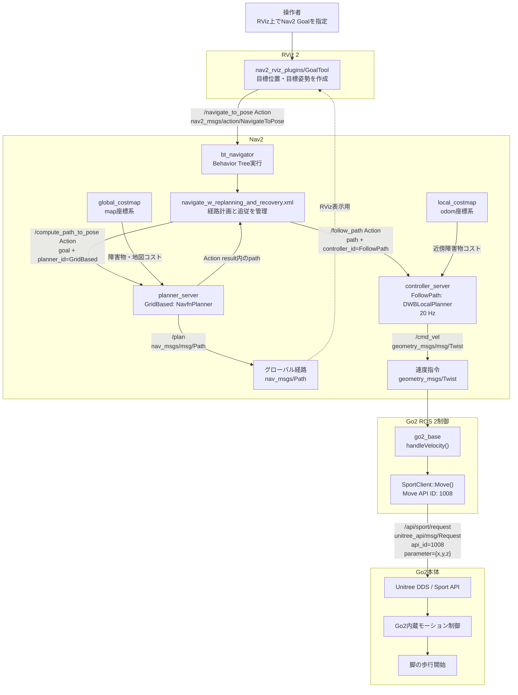
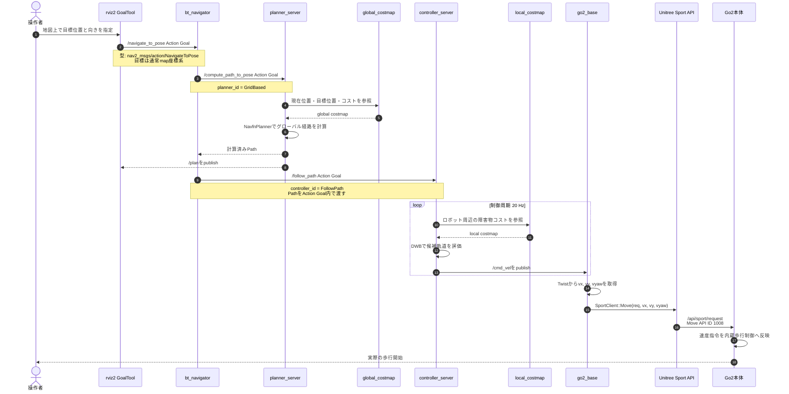
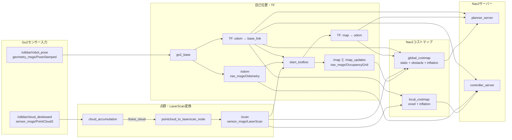
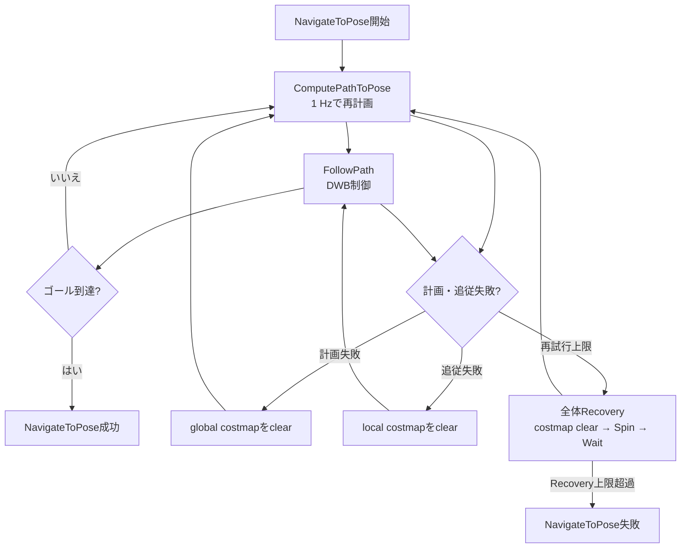

# RVizからNav2経由でGo2が動き出すまでの処理フロー

## 対象構成

この資料は、次の起動構成を対象とする。

```bash
source /opt/ros/foxy/setup.bash
source ~/unitree_ros2/install/setup.bash
source ~/go2_ros2_ws/install/setup.bash
ros2 launch go2_core go2_startup.launch.py
```

`go2_startup.launch.py`から、主に以下が起動される。

- `rviz2`
- `go2_base`
- `cloud_accumulation`
- `pointcloud_to_laserscan_node`
- `slam_toolbox`
- Nav2の`planner_server`
- Nav2の`controller_server`
- Nav2の`recoveries_server`
- Nav2の`bt_navigator`
- Nav2の`waypoint_follower`
- `lifecycle_manager_navigation`

Nav2パラメータは、実行時に以下のファイルが使用される。

```text
/home/unitree/go2_ros2_ws/install/go2_navigation/share/go2_navigation/config/nav2_params.yaml
```

## メインフロー



## 時系列フロー



## 経路計画・制御に必要な入力



## ノードとインターフェース一覧

| 送信元 | インターフェース | 型 | 受信先・用途 |
|---|---|---|---|
| RViz `GoalTool` | `/navigate_to_pose` Action | `nav2_msgs/action/NavigateToPose` | `bt_navigator`へナビゲーション目標を送信 |
| `bt_navigator` | `/compute_path_to_pose` Action | `nav2_msgs/action/ComputePathToPose` | `planner_server`へ経路計画を要求 |
| `planner_server` | `/plan` Topic | `nav_msgs/msg/Path` | グローバル経路の可視化 |
| `bt_navigator` | `/follow_path` Action | `nav2_msgs/action/FollowPath` | `controller_server`へ経路追従を要求 |
| `controller_server` | `/cmd_vel` Topic | `geometry_msgs/msg/Twist` | `go2_base`へ速度指令を送信 |
| `go2_base` | `/api/sport/request` Topic | `unitree_api/msg/Request` | Go2のSport APIへ移動指令を送信 |
| Go2 LiDAR | `/utlidar/robot_pose` Topic | `geometry_msgs/msg/PoseStamped` | `go2_base`がオドメトリとTFへ変換 |
| `go2_base` | `/odom` Topic | `nav_msgs/msg/Odometry` | `bt_navigator`、`controller_server`、SLAMが使用 |
| `go2_base` | `/tf` | `tf2_msgs/msg/TFMessage` | `odom → base_link`を配信 |
| Go2 LiDAR | `/utlidar/cloud_deskewed` Topic | `sensor_msgs/msg/PointCloud2` | 点群処理の入力 |
| `cloud_accumulation` | `/trans_cloud` Topic | `sensor_msgs/msg/PointCloud2` | LaserScan変換の入力 |
| `pointcloud_to_laserscan_node` | `/scan` Topic | `sensor_msgs/msg/LaserScan` | SLAM、global/local costmapが使用 |
| `slam_toolbox` | `/map` Topic | `nav_msgs/msg/OccupancyGrid` | global costmapが使用 |
| `slam_toolbox` | `/tf` | `tf2_msgs/msg/TFMessage` | `map → odom`を配信 |

## ROS 2 Actionの実体

`/navigate_to_pose`、`/compute_path_to_pose`、`/follow_path`は通常の単一トピックではなくROS 2 Actionである。各Actionは内部的に、概ね以下のサービスとトピックで構成される。

```text
/<action_name>/_action/send_goal
/<action_name>/_action/get_result
/<action_name>/_action/cancel_goal
/<action_name>/_action/feedback
/<action_name>/_action/status
```

例:

```text
/navigate_to_pose/_action/send_goal
/navigate_to_pose/_action/feedback
/navigate_to_pose/_action/status
```

## Behavior Treeの処理

使用されるBehavior TreeはNav2 Foxy標準の以下である。

```text
/opt/ros/foxy/share/nav2_bt_navigator/behavior_trees/
  navigate_w_replanning_and_recovery.xml
```

通常処理は次の順序になる。



## Go2が動き始める成立条件

Go2が実際に歩き始めるのは、以下がすべて成立した後である。

1. `bt_navigator`が`/navigate_to_pose` Goalを受理する。
2. `map → odom → base_link`のTFが解決できる。
3. `planner_server`が有効なグローバル経路を生成する。
4. `controller_server`が`/follow_path`を受理する。
5. local costmapと現在姿勢を使い、DWBが有効な速度候補を選択する。
6. `controller_server`がゼロではない`/cmd_vel`をpublishする。
7. `go2_base`が`/cmd_vel`をMove API ID `1008`へ変換する。
8. Go2本体のSport Modeが指令を受け付ける。

`go2_base`は速度値を次のように変換する。

```text
/cmd_vel.linear.x  → parameter.x
/cmd_vel.linear.y  → parameter.y
/cmd_vel.angular.z → parameter.z
```

3軸がすべて厳密にゼロの場合、Move APIに加えてStopMove API ID `1003`も送信する。

## 現在の主要パラメータ

実行時のinstall版設定では以下となっている。

| 項目 | 値 |
|---|---:|
| Controller | `dwb_core::DWBLocalPlanner` |
| Controller周期 | 20 Hz |
| Global planner | `nav2_navfn_planner/NavfnPlanner` |
| BT再計画周期 | 1 Hz |
| `max_vel_x` | 3.0 m/s |
| `max_vel_theta` | 1.5 rad/s |
| `min_speed_xy` | 0.3 m/s |
| Goal XY許容誤差 | 0.40 m |
| Goal yaw許容誤差 | 3.14 rad |
| local costmap | 3 m × 3 m、0.05 m/cell |
| ロボット半径 | 0.22 m |

## 動作確認用コマンド

実機を動かさずに接続状態を確認する場合:

```bash
ros2 action list
ros2 action info /navigate_to_pose
ros2 action info /compute_path_to_pose
ros2 action info /follow_path

ros2 topic info /cmd_vel
ros2 topic info /api/sport/request
ros2 topic info /scan
ros2 topic info /odom
ros2 topic info /map

ros2 node info /bt_navigator
ros2 node info /planner_server
ros2 node info /controller_server
ros2 node info /go2_base

ros2 run tf2_ros tf2_echo map odom
ros2 run tf2_ros tf2_echo odom base_link
```

